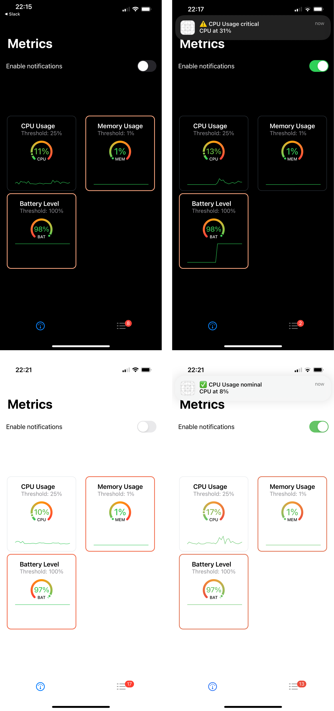

# DataDog

My assignment for the position of Sr. iOS Engineer at DataDog

The app is built using `Swift`, `SwiftUI` & `Combine`.

## Architecture

The app is built using an MVVM architecture. There are 3 Views (Scenes) and ViewModels, as well as 2 non-view related controllers/managers.

### Views & ViewModels

#### Root

The top-most view of the app, and the first thing the user sees is a simple Tab bar view, that lays out the Metrics view & the Events view.

Like the `Root View`, the `Root ViewModel` is relatively simple as well, handling tab selection & showing badge numbers on the events tab bar item.

#### Metrics

This view shows gauges for the various metrics published by the Watcher SDK.
It support both light & dark modes.

You will notice some metrics have a red-ish border around them; this signifies that the metric is currently beyong its allowed threshold. This animates in real time and goes back to a light-grey border under nominal conditions.

Furthermore, this view also allows the user to chose to receive notifications when metrics cross their threshold. They can do so by flicking the 'Enable notifications' toggle, which will prompt them with a system alert the first time they do so.

Finally, it is also possible for the user to edit a metric's threshold. This can be done simply by tapping said metric, which will reveal a threshold editor pane where changes are reported instantly.

While the user is on this view, the in-app badge (& on the app icon if notification permissions were given) is incremented whenever a metric crosses its threshold.

#### Events

The events view shows a list of all metric threshold events emitted since the app was started, with the most recent event at the top.

This view also allows the user to chose whether or not the app should report nominal events (this also affects the notifications that are sent).

While the user is on this view, badges (in-app, & on the app icon) are not incremented. This is a way for the user to get rid of badges.

In case no events have been emitted yet, this is what the user will see:

## Background Processing

The app makes use of the SDK's background tasks processing. If notifications are allowed by the user, simply leaving the app will start said background processes and schedule notifications over time (though, with much longer delays as Apple severely restricts apps from doing too much work in the background).

Here is an example of such notifications:

## App shortcomings

The app does not to persist any data (such as user threshold selection or events). This was a conscious decision, but because the app is written in a way that permits dependency injection, implementing this would not be too much work.

Also, while the SDK works with `Float` values, most of the time we want to treat these as percentages, and thus should not accept any values outside the `0.0...1.0` range. I've tried to check and clamp these values whenever I could (through unit tests), but I'm guessing there are some parts where a non-clamped value could still get through.

Additionally, the Watcher SDK does very little logging & mostly silently ignores errors. This is not ideal, and in a real world setting would pose real difficulties with debugging. Again though, this was a conscious decision in the interest of time, and would be relatively easy to incorporate (i.e with `OSLog`).

Lastly, there are some bugs which I could not figure out how to fix; namely, while running in the background, the app will sometimes emit `NaN` values which would make their way to the user through notifications, before crashing while attempting to access the CPU load metric. I'm not too sure why that happens, although I'm guessing it has to do with the thread `NSLock`.
