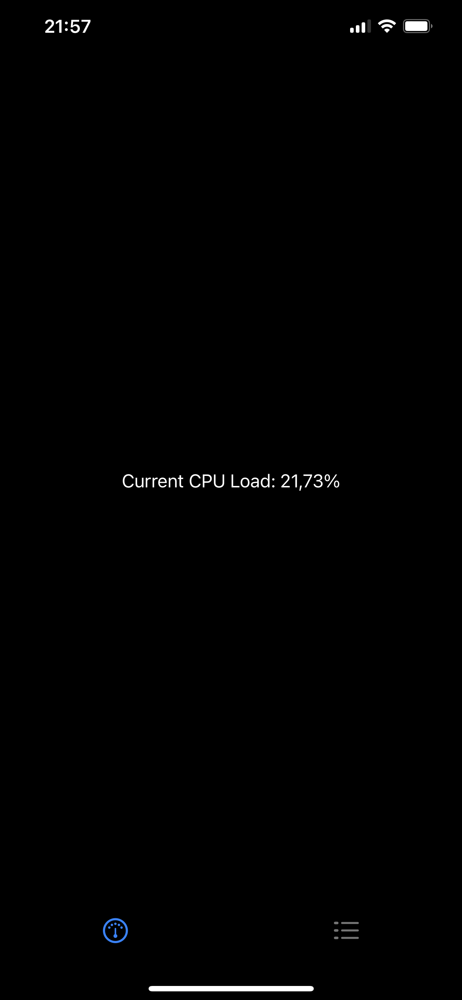
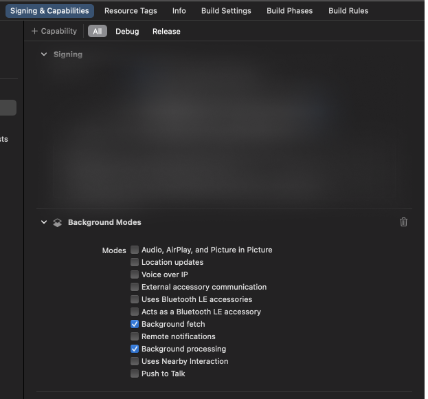

# DataDogWatcher

## What

**System Metrics over Combine**

Use this package to easily gather System metrics like CPU & Memory usage or battery level.
These metrics are provided over regular Combine publishers so you can easily use them throughout your app.

The package was also written with SwiftUI in mind; all classes are mockable so you can always rely on your Previews!

## Why

Because ain't nobody got time to manipulate raw pointers & memory to gather such basic data! (and also, _someone might implement this because they want a job at an awesome company_ 🙃)

# Using this package

## TL;DR?

Import the package as a dependency, create an instance of `Watcher` on App launch (**important**), then subscribe to the metric manager of your choice through Combine:

```swift
let watcher = Watcher.configure(cpuThreshold: 0.5,
                                memoryLoadThreshold: 0.5,
                                batteryLevelThreshold: 0.2,
                                refreshFrequency: 0.3)
watcher.memoryLoad.publisher.sink { value in
  print("Memory in use: \(value) Mb") // prints "Memory in use: 17.3 Mb" for example
}
```

## The slightly longer tutorial

### Create a local instance

Start by overriding your app's `didFinishLaunching` function and create a local `Watcher` instance through the `.configure(_:)` function.

This function requires a few threshold parameters, expressed as percentage values. These percentages are used to emit `MetricThresholdEvents`, to let you know whenever a metric goes beyond a certain value.

```swift
import Watcher

var watcher: Watcher?

func application(_ application: UIApplication, didFinishLaunchingWithOptions launchOptions: [UIApplication.LaunchOptionsKey: Any]? = nil) -> Bool {
  watcher = Watcher.configure(cpuThreshold: 0.25,
                              memoryLoadThreshold: 0.01,
                              batteryLevelThreshold: 0.9999,
                              refreshFrequency: 0.3)

  return true
}
```

**Important**
Make sure you configure Watcher in `didFinishLaunching`, as doing so later will cause a crash. This is because Watcher schedules background tasks, and those need to be registered on app launch.

### Use it in your views

Now that you havea a `Watcher` instance, you can pass it around to your views as needed to display live system stats. Nice!

Here's a quick example of how to display the CPU load:

```swift
import SwiftUI
import Combine
import Watcher

struct ContentView: View {
  let watcher: Watcher

  @State
  var cpuLoad: Float = 0

  var body: some View {
    Text("Current CPU Load: \(cpuLoad * 100, specifier: "%1.2f")%")
      .onReceive(watcher.cpuLoadManager.percentagePublisher) { value in
        self.cpuLoad = value
      }
  }
}
```

Which looks like this



And that's pretty much it. Easy peasy, right?

### Fetching System Metrics in the background

The package can also operate in the background. This is way less accurate however, since Apple strictly prevents apps from from doing too much work while in the background. Still, you can choose to opt into background notifications and get them every so often (once an hour or so, but your mileage may vary).

Before you can make use of this functionality however, you'll need to follow the next 3 steps.

#### 1: Add Background Modes Capability

Go to your project's `Signing & Capabilities` panel, add the Background Modes capability, and select `Background fetch` & `Background processing`.



#### 2: Register the Watcher's Background Task Identifier

This package uses the following background task identifier: `com.datadog.watcher.background-process`

This needs to be added to your App's `Info.plist`:

- Key: `BGTaskSchedulerPermittedIdentifiers` as Array
- Value: `com.datadog.watcher.background-process` as String

or, as raw XML:

```xml
<key>BGTaskSchedulerPermittedIdentifiers</key>
<array>
  <string>com.datadog.watcher.background-process</string>
</array>
```

#### 3: Notify the Watcher when the app enters background

This can simply be done by calling the `enableBackgroundFetching()` function on your watcher instance.
That's it, now the Watcher will occasionally fetch & publish system status metrics while your app's in the background.

## Going Beyond

### Journaling

The Watcher also offers an `eventProvider` instance. Whenever a metric crosses its threshold, it notifies listeners through emitting `MetricThresholdState` events.

The `EventProvider` listens to these, and republishes them as `MetricThresholdEvents`, with a full date & time, metric state (critical or nominal), metric value & percentage, as well as which metric generated the event (cpu, memory or battery).

You can use & subscribe to the `EventProvider` to journalise all such events in convenient manner.

By default, the `Watcher.eventProvider` instance publishes events for all 3 metric managers. You can however instantiate your own event provider if you so desire, and only register a single metric manager. For example, you could just listen to battery level events like so:

```swift
let batteryEventProvider = EventProvider()
batteryEventProvider.register(watcher.batteryLevelManager, for: .battery)
// you now have an event provider that only emits
// when the battery level crosses its threshold
```

### Injecting & Mocking

Watcher is easy to use in your SwiftUI apps and makes it possible to write tests; all types conform to & use public protocols.

The Watcher's metric managers all conform to `MetricManagerUseCase`, and they themselves rely on `MetricProviderUseCase`.

It is therefore very easy to write mocks and have complete control over the values emitted, making it easy to test edge cases in your SwiftUI Previews.

For example, you could write a `MetricProvider` that always returns the same value, with some noise:

```swift
/// Provides a fixed value with some noise
class NoisyMetricProvider: MetricProviderUseCase {
  static let minValue: Float = 0.0
  static let maxValue: Float = 1.0

  private var metric: Float

  init(initialValue: Float = 0.5) {
      self.metric = initialValue
  }

  func fetchMetric() throws -> Float {
    let delta: Float = .random(in: 0.05...0.25)

    // decide if delta is positive or negative
    let sign: Float = .random() ? 1.0 : -1.0

    return metric + (delta * sign)
  }
}
```

Then use this with a regular `MetricManager`:

```swift
let noisyManager = MetricManager(metricProvider: NoisyMetricProvider(),
                                 threshold: 0.5,
                                 refreshFrequency: refreshFrequency,
                                 queue: .init(label: UUID().uuidString,
                                              qos: .background))
```

Or event write a mock implementation of the `MetricManagerUseCase` itself (which is a bit more involved, but still very manageable).

## Glossary

### Threshold

The threshold as used in this package defines a fixed limit beyond which a metric manager emits Threshold state event.

By default, the battery threshold is _inversed_; that is, valid battery levels are those above the given threshold. In the example above, this means the battery level will only be considered nominal if it is above `99.99%`, and any level _below_ that will be considered critical.

For CPU & Memory load, the threshold are used in the more standard way where, if the values reach & go beyond it, then they are considered critical. Anything _below_ the threshold will be considered nominal.

### MetricManager(UseCase)

The watcher instance holds metric managers;

- `watcher.cpuLoadManager`: The CPU Load manager, which reports total CPU usage and events related to the CPU load.
  It publishes this as a relative value (a percentage of its alotted performance) between `0.0` & `1.0`.
- `watcher.memoryLoadManager`: The Memory Load manager, which reports total system RAM usage in Mb.
- `watcher.batteryLevelManager`: The Battery Level manager, which reports device battery level, as a percentage of the current battery capacity.

Each Manager holds a few variables;

- `publisher`: The main value publisher. For the CPU Manager, emits the relative usage in %, for the Memory Manager, emits the amount of used system RAM in Mb and for the Battery Manager, emits the remaining battery percentage.
- `percentPublisher`: The manager's value publisher, but expressed as a percentage of its min & max values. For the CPU & Battery manager, this is the same value as emitted by `publisher`, but for the Memory Manager, this returns the current memory use as a percentage of the max RAM on the device.
- `threshold` & `thresholdPublisher`: The threshold value & its publisher. The threshold is set when you create the `Watcher` instance, but it can also be modified later down the road. Use the publisher to subscribe to updates.
- `thresholdRange` & `thresholdRangePublisher`: The manager's threshold range, and its publisher.
  A `ThresholdRange` represents how a metric should treat the range of valid values with regards to its threshold. It can be one of two values;
  - `.lower`: The default representation considers the `lower` range of values as valid (that is, values numerically _below_ the threshold). Therefore, `MetricThresholdState.critical` events are emitted when the metric increases, and goes numerically _above_ its threshold.
  - `.upper`: Inversely, the `upper` representation treats values as valid if they are numerically _above_ the threshold. That is, `MetricThresholdState.critical` events are emitted when the metric decreases, and goes numerically _below_ its threshold.
- `thresholdStatePublisher`: Whenever the metric crosses its threshold (in either direction), this publisher emits a `MetricThresholdState` value.
  These also hold the metric value (and percentage) of when it happened.
- `refreshFrequency` & `refreshFrequencyPublisher`: How often this manager publishes its metric's value, in seconds. Subscribe to the publisher to be notified of changes.

## Installation

This package is available as a Swift Package

To install it, simply drag & drop it into your project
